<div align="center">

### An *Agents for Humans* Hackathon Project · Professional Agents Track

# 🧭 Re:Route AI

### Never lose your learning path at AWS re:Invent.
**The destination stays the same. The route can change.**

[](https://d315hfgmfqehyn.cloudfront.net)
[](LICENSE)
[](#)
[](#)


**Built with the [Strands Agents SDK](https://strandsagents.com) on Amazon Bedrock (Nova) for the _Agents for Humans_ hackathon · Track: Professional Agents.**

[Live Demo](https://d315hfgmfqehyn.cloudfront.net) ·
[Architecture](#-architecture) ·
[How It Works](#-how-it-works) ·
[Agent Watch](#-agent-watch--autonomous-monitoring) ·
[Run Locally](#-getting-started) ·
[Contributors](#-contributors)

</div>

---

## 📑 Table of Contents

- [Overview](#-overview)
- [Try It in 60 Seconds](#-try-it-in-60-seconds)
- [At a Glance](#-at-a-glance)
- [Architecture](#-architecture)
- [How It Works](#-how-it-works)
- [Agent Roles](#-agent-roles)
- [Route Planning & Plans A/B/C](#-route-planning--plans-abc)
- [Recovery & Re-routing](#-recovery--re-routing)
- [Agent Watch — Autonomous Monitoring](#-agent-watch--autonomous-monitoring)
- [Graceful Degradation](#-graceful-degradation)
- [Project Structure](#-project-structure)
- [Getting Started](#-getting-started)
- [Enabling Live AWS Services](#-enabling-live-aws-services)
- [Session Catalog](#-session-catalog)
- [Deploy to AWS](#-deploy-to-aws)
- [API Reference](#-api-reference)
- [Testing](#-testing)
- [Contributors](#-contributors)
- [Contributing](#-contributing)
- [License](#-license)

---

## 🌟 Overview

AWS re:Invent has **1,500+ sessions spread across six Las Vegas venues**. Building a
workable schedule is repetitive, time-draining work — and the moment a session fills
up, gets cancelled, or a venue transition turns out to be impossible, you have to
start over.

**Re:Route AI takes that work off the attendee's plate.**

You state a learning goal in plain language — *"I want to get production-ready with AI
agents"* — and Re:Route builds a realistic, walkable route. Then it **keeps running in
the background** and only pulls you in when a real decision is needed: a session fills
up, a route breaks. It arrives with the fix **already worked out**.

| The old way | With Re:Route AI |
|---|---|
| Manually browse 1,500+ sessions | Describe a goal in plain language |
| Guess whether venues are walkable | Venue-to-venue travel time and buffers built in |
| Re-plan by hand when a session fills | Automatic recovery with pre-analyzed replacements |
| Keep refreshing the catalog | Agent Watch monitors and pings you only on a decision |

---

## ⚡ Try It in 60 Seconds

1. **Live demo →** <https://d315hfgmfqehyn.cloudfront.net> — on the chat page, type
   *"I'm new — build me a plan for learning GenAI"*, then open **Agent Watch**.
2. **Run locally →** see [Getting Started](#-getting-started). It works with **zero AWS
   credentials** — a deterministic pipeline stands in for the model.
3. **See the design →** [architecture diagram](docs/architecture.drawio) ·
   [How it works](#-how-it-works) · [Agent Watch](#-agent-watch--autonomous-monitoring).

---

## 📌 At a Glance

| | |
|---|---|
| **Live demo** | <https://d315hfgmfqehyn.cloudfront.net> |
| **Agent framework** | AWS Strands Agents SDK (real `Agent` + tool-calling loop + `structured_output`) |
| **AWS services** | Amazon Bedrock **Nova** (reasoning) · **Titan** embeddings (semantic search + RAG) · **Polly** (voice) · **Lambda + API Gateway + Function URL** · **S3 + CloudFront** |
| **Backend** | Python · FastAPI · Pydantic · pytest |
| **Frontend** | React 19 · TypeScript · Vite · Tailwind CSS |
| **License** | [MIT](LICENSE) |
| **Architecture source** | [`docs/architecture.drawio`](docs/architecture.drawio) |

> **Everything degrades gracefully.** With no AWS credentials, the same agent tools
> run in a deterministic pipeline, so the app always works. `GET /api/health` reports
> which path is live, honestly.

---

## 🏗️ Architecture


*Editable source: [`docs/architecture.drawio`](docs/architecture.drawio)*

### System overview

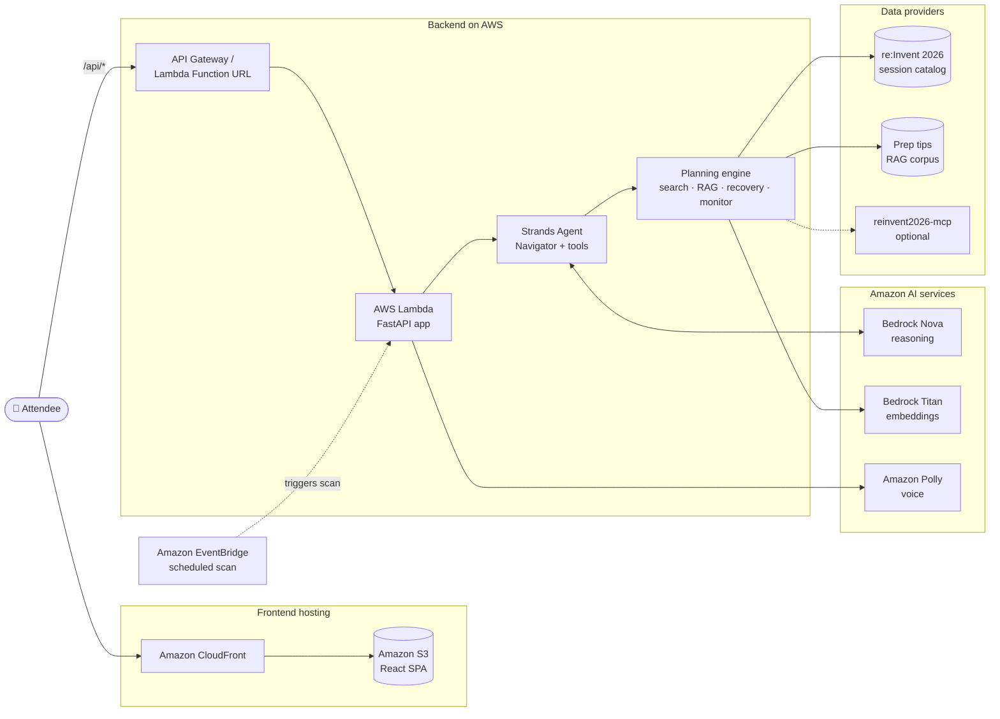

### Layered design

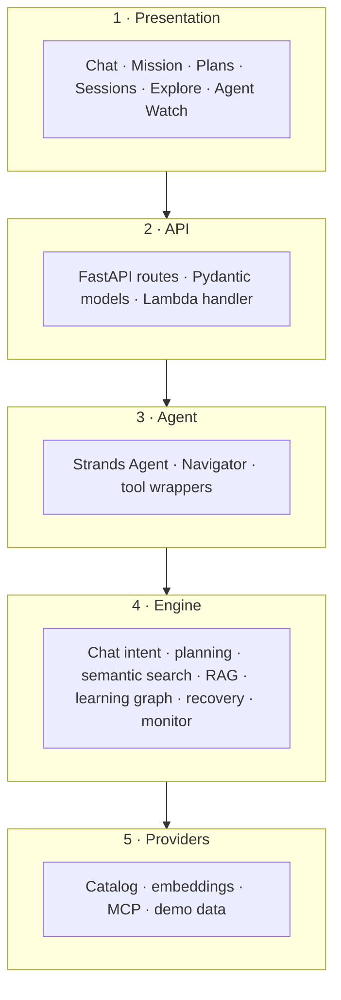

---

## 🧠 How It Works

A newcomer lands on a **chat page** and simply talks to the **Navigator**. Based on what
they ask, the agent will:

- **Explain** what re:Invent is and how to get started
- **Find sessions** for a topic from the real 1,500+ session catalog
- **Give prep advice** grounded in past-attendee tips (RAG)
- **Build a route** — a full day-by-day plan, or three ranked options:
  **Plan A (ideal) / Plan B (backup) / Plan C (low-risk)**
- **Re-route** when a session becomes full or cancelled, protecting the learning goal

### Request lifecycle

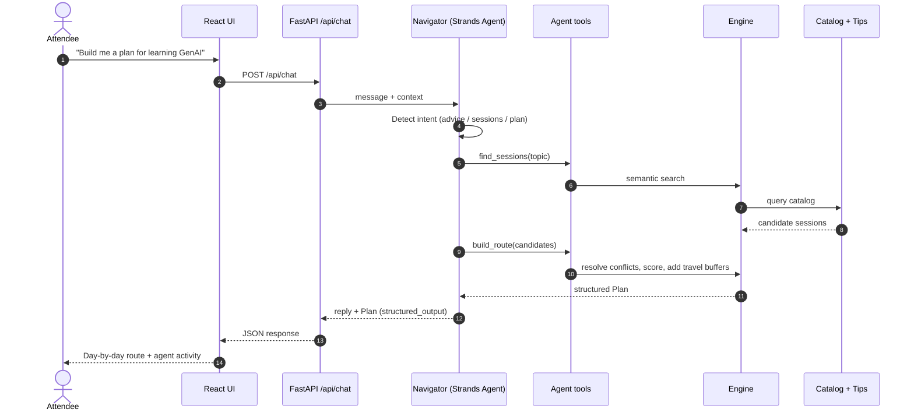

---

## 🤖 Agent Roles

Under the hood, specialized agent roles are surfaced in the UI so users can see *who* is
doing *what*.

| Role | Responsibility |
|------|----------------|
| 🧭 **Navigator** | Understands the goal, coordinates the others, explains changes |
| 🔎 **Session Scout** | Finds matching sessions, repeats and fallbacks |
| 🛣️ **Route Planner** | Resolves conflicts, scores learning vs. walking vs. risk |
| 🧭 **Wayfinder** | Venue-to-venue travel time and buffers |
| 🔄 **Recovery Navigator** | Reacts when a session is missed/full and re-routes |

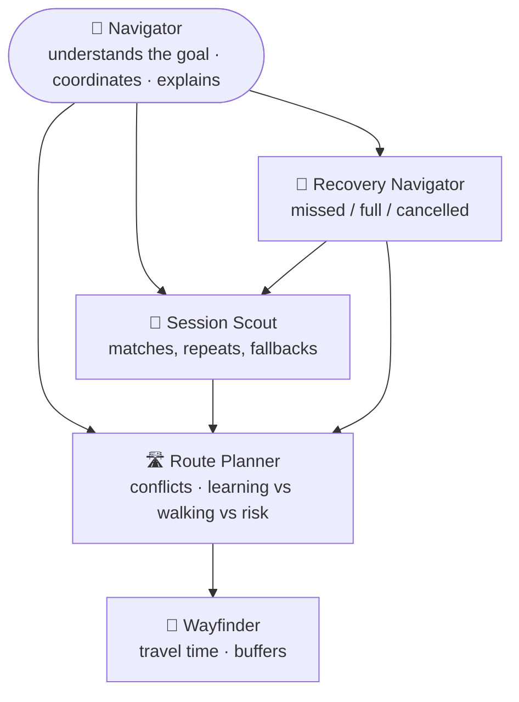

---

## 🛣️ Route Planning & Plans A/B/C

The Route Planner scores every candidate route on three competing dimensions, then
presents ranked options so the attendee chooses the trade-off they prefer.

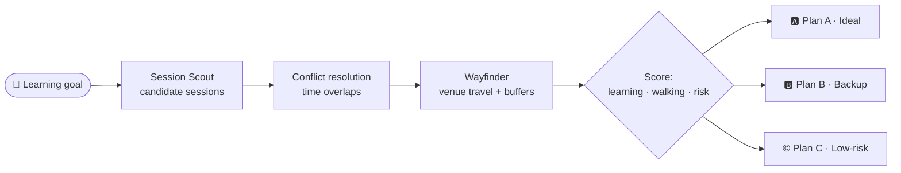

| Plan | Purpose |
|------|---------|
| **Plan A — Ideal** | The best route for the learning goal |
| **Plan B — Backup** | A ready alternative if Plan A is disrupted |
| **Plan C — Low-risk** | A safer route that reduces the chance of a broken schedule |

---

## 🔄 Recovery & Re-routing

When a session is full, cancelled, or a venue transition becomes infeasible, the
**Recovery Navigator** rebuilds the route while **protecting the learning goal** — the
destination stays the same, only the route changes.

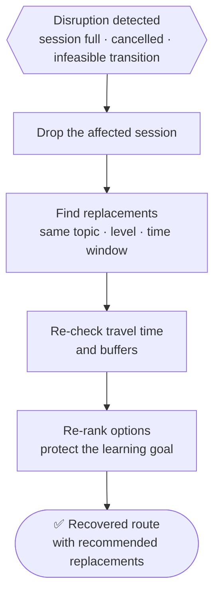

Trigger it manually with `POST /api/reroute`, or let [Agent Watch](#-agent-watch--autonomous-monitoring)
do it for you.

---

## 👁️ Agent Watch — Autonomous Monitoring

Once your route is built, Re:Route stops being an app you babysit. The **autonomous
monitor** ([`app/engine/monitor.py`](backend/app/engine/monitor.py)) watches your selected
sessions and, on each scan tick — an **Amazon EventBridge / cron schedule in production**,
or `POST /api/monitor/scan` in the demo — re-checks the route against changing
conditions:

- a session that **just filled up**
- a session that was **cancelled**
- a venue transition that turned **infeasible**

It stays **quiet while the route is healthy**. When something *changes* and needs a human
call, it opens a **decision** that already carries the pre-analyzed fix (recommended
replacement sessions from the recovery engine) and asks you to **approve or dismiss**.
That is the only moment you're pulled in. The **Agent Watch** page shows a calm green
state and lights up only when a decision is pending.

### Monitor state machine

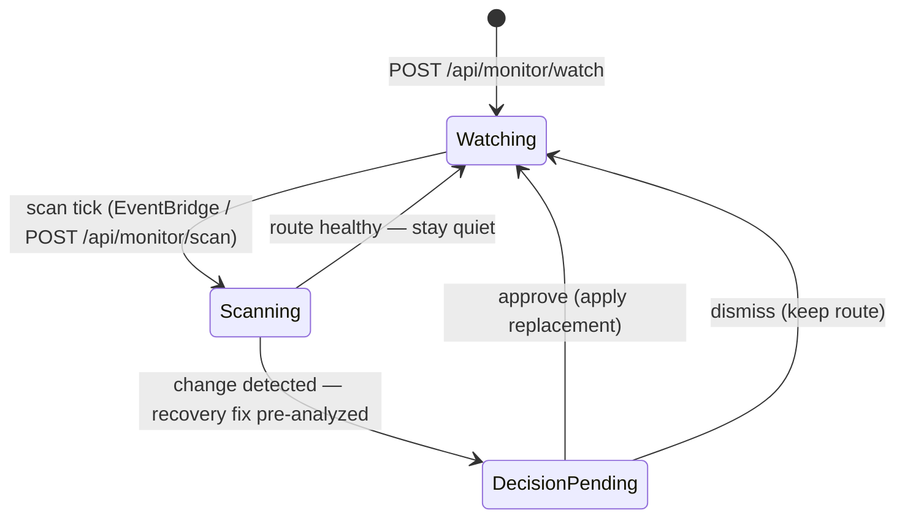

### Monitor sequence

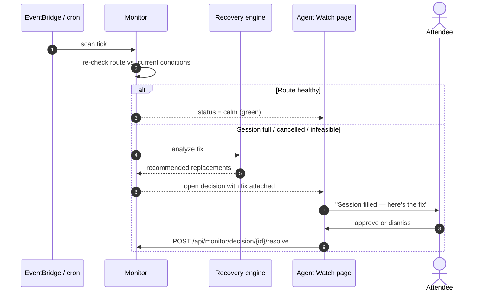

**Endpoints:**

| Endpoint | Purpose |
|----------|---------|
| `POST /api/monitor/watch` | Start watching a route |
| `POST /api/monitor/scan` | Run a scan tick (demo trigger for the scheduler) |
| `GET /api/monitor/status` | Current health and any pending decisions |
| `POST /api/monitor/decision/{id}/resolve` | Approve or dismiss a decision |

---

## 🛡️ Graceful Degradation

All AWS features are **off by default**. The same agent tools run either way, so the app
always works — with or without credentials.

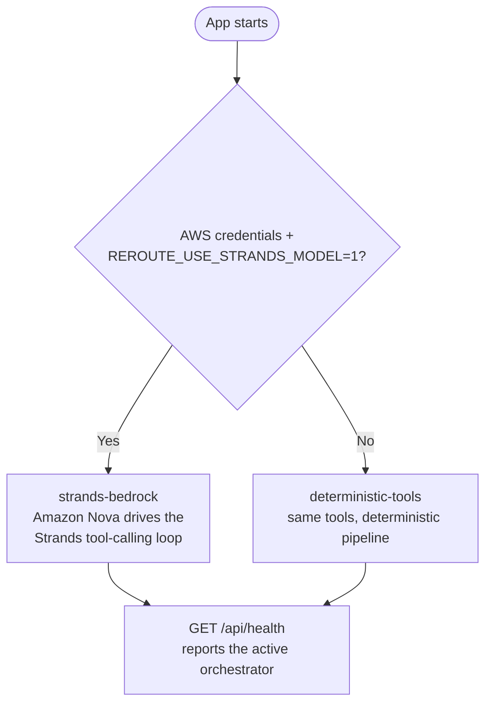

| Capability | With AWS enabled | Without AWS (default) |
|---|---|---|
| Reasoning | Amazon Nova via Strands | Deterministic tool pipeline |
| Semantic search | Titan embeddings | Local search over bundled catalog |
| Voice readout | Amazon Polly | Disabled |
| Session data | Bundled catalog or MCP server | Bundled catalog |

---

## 🗂️ Project Structure

```text
.
├── backend/                     # FastAPI + Strands agent + planning engine
│   ├── app/
│   │   ├── api.py               # FastAPI app + all /api endpoints
│   │   ├── models.py            # Pydantic response models (Plan, RerouteResult…)
│   │   ├── lambda_handler.py    # AWS Lambda entry point
│   │   ├── agent/               # Strands agent, Navigator, tool wrappers
│   │   ├── engine/              # chat, planning, semantic search, RAG, learning graph, monitor
│   │   └── providers/           # Data providers (catalog, embeddings, MCP, demo)
│   ├── data/                    # re:Invent session catalog + prep tips (RAG)
│   ├── scripts/                 # Catalog refresh utility
│   ├── tests/                   # pytest suite
│   └── requirements.txt
│
├── frontend/                    # React 19 + TypeScript + Vite + Tailwind
│   └── src/
│       ├── pages/               # Chat (landing), Mission, Plans, Sessions, Explore…
│       ├── components/          # ui/ kit, layout/ shell, agent/ activity
│       └── lib/                 # API client, mappers, mission store
│
├── infra/                       # AWS SAM / CloudFormation templates
│   ├── reroute-lambda.yaml      # Backend: Lambda + Function URL + API Gateway
│   └── reroute-frontend-hosting.yaml   # Frontend: S3 + CloudFront
│
└── docs/                        # Architecture diagram, catalog export, MCP notes
```

---

## 🚀 Getting Started

### Prerequisites

| Tool | Purpose |
|------|---------|
| Python 3.x + `pip` | Backend |
| Node.js + `npm` | Frontend |
| Git | Clone the repository |
| AWS credentials *(optional)* | Only needed for live Bedrock / Polly features |

### 1 · Clone

```bash
git clone https://github.com/MariyamSeemab/Re-Route-AI.git
cd Re-Route-AI
```

### 2 · Backend

```bash
cd backend
python -m venv .venv
# Windows:      .venv\Scripts\Activate.ps1
# macOS/Linux:  source .venv/bin/activate
pip install -r requirements.txt
python -m uvicorn app.api:app --reload --port 8000
```

The API runs at `http://localhost:8000` (interactive docs at `/docs`). It works fully in
demo mode with **no AWS credentials**.

### 3 · Frontend

```bash
cd frontend
npm install
npm run dev
```

Opens at `http://localhost:5173` and proxies `/api` to the backend on `:8000`.

### Local development topology

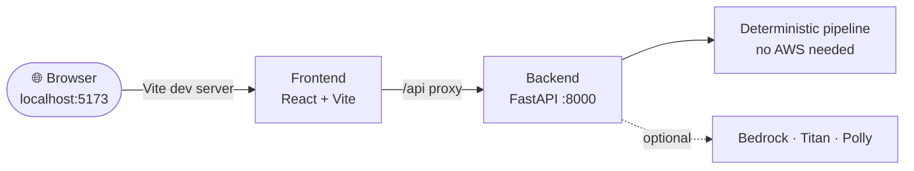

---

## ☁️ Enabling Live AWS Services

Turn live services on with environment variables plus AWS credentials that have
**Bedrock/Polly access**. `GET /api/aws/status` reports which services are live.

| Variable | Enables |
|----------|---------|
| `REROUTE_USE_STRANDS_MODEL=1` | Amazon Nova drives the Strands tool-calling loop |
| `REROUTE_USE_BEDROCK_EMBEDDINGS=1` | Amazon Titan embeddings for semantic search |
| `REROUTE_USE_POLLY=1` | Amazon Polly voice readout |
| `REROUTE_MODEL=nova-pro` | Model choice: `nova-premier` / `nova-pro` / `nova-lite` / `nova-micro` |
| `AWS_REGION=us-east-1` | A region with Bedrock model access enabled |

> The models are **Amazon-only** (Nova family on Bedrock). `GET /api/health` reports the
> active orchestrator (`strands-bedrock` or `deterministic-tools`) honestly.

---

## 📚 Session Catalog

The app ships with the real **re:Invent 2026 catalog** at
`backend/data/reinvent2026_sessions.json`, loaded by default. To refresh it or import your
own export, see [`docs/GET_CATALOG.md`](docs/GET_CATALOG.md).

You can also serve sessions from the standalone
[`reinvent2026-mcp`](https://github.com/MariyamSeemab/reinvent2026-mcp) server over
MCP — see [`docs/MCP_SERVER.md`](docs/MCP_SERVER.md). Without it, the bundled catalog is
used.

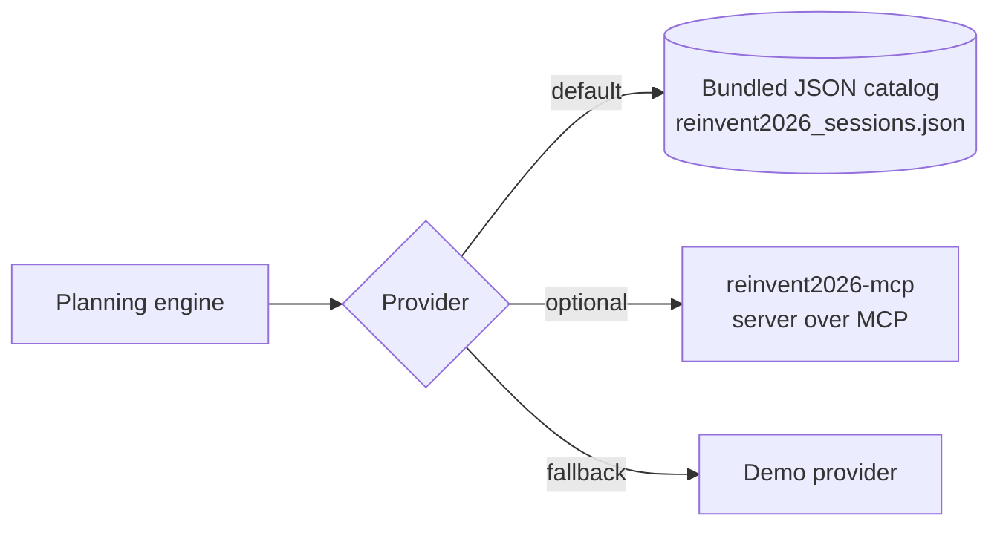

---

## 🚢 Deploy to AWS

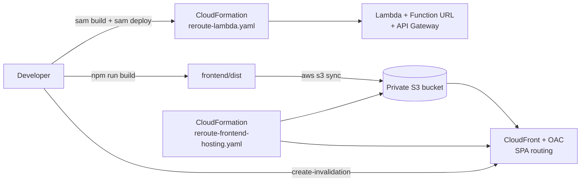

### Backend — Lambda + Function URL

Uses SAM; build in a container so native dependencies resolve for the Lambda runtime:

```bash
cd infra
sam build --template reroute-lambda.yaml --use-container
sam deploy --region us-east-1 --stack-name reroute-ai --resolve-s3 \
  --capabilities CAPABILITY_IAM --no-confirm-changeset \
  --parameter-overrides "BedrockModel=nova-pro UseBedrockModel=1 UseBedrockEmbeddings=1 UsePolly=1"
```

### Frontend — S3 + CloudFront

Point `frontend/.env.production` at the backend's Function URL, then build and sync:

```bash
cd frontend
npm run build
aws s3 sync dist "s3://<your-site-bucket>" --delete --region us-east-1
aws cloudfront create-invalidation --distribution-id <your-dist-id> --paths "/*"
```

The frontend hosting stack (`infra/reroute-frontend-hosting.yaml`) provisions a **private S3
bucket**, **CloudFront with origin access control**, and **SPA routing**.

---

## 🔌 API Reference

| Endpoint | Method | Purpose |
|----------|--------|---------|
| `/api/chat` | `POST` | Conversational entry point (intent → advice / sessions / plan) |
| `/api/plan` | `POST` | Build a full route from a mission |
| `/api/plans/abc` | `POST` | Three ranked plans: ideal / backup / low-risk |
| `/api/reroute` | `POST` | Recover a route when a session is dropped |
| `/api/advice` | `POST` | RAG preparation tips |
| `/api/catalog/filter` | `GET` | Filter the full catalog by topic / level / format / venue / day |
| `/api/monitor/watch` | `POST` | Start watching a route |
| `/api/monitor/scan` | `POST` | Run a monitor scan tick |
| `/api/monitor/status` | `GET` | Monitor health and pending decisions |
| `/api/monitor/decision/{id}/resolve` | `POST` | Approve or dismiss a decision |
| `/api/health` | `GET` | Runtime status and active orchestrator |
| `/api/aws/status` | `GET` | Which AWS services are live |

Interactive OpenAPI docs are served at `/docs` when running the backend.

---

## ✅ Testing

```bash
cd backend
python -m pytest -q
```

---

## 👥 Contributors

Re:Route AI is built by:

<table>
  <tr>
    <td align="center" width="200">
      <a href="https://github.com/MariyamSeemab">
        <br />
        <sub><b>MariyamSeemab</b></sub>
      </a>
    </td>
    <td align="center" width="200">
      <a href="https://github.com/dineshrajdhanapathyDD">
        <br />
        <sub><b>dineshrajdhanapathyDD</b></sub>
      </a>
    </td>
  </tr>
</table>

---

## 🤝 Contributing

Contributions, issues, and ideas are welcome.

### Workflow

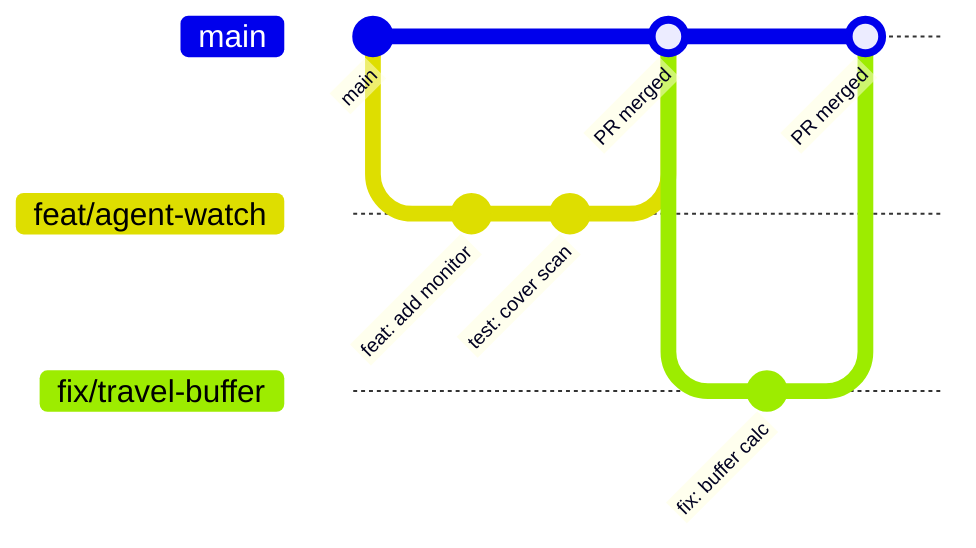

1. **Fork** the repository and create a branch from `main`:
   ```bash
   git checkout -b feat/your-feature
   ```
2. **Make your changes** and add or update tests in `backend/tests/`.
3. **Run the test suite** before committing:
   ```bash
   cd backend && python -m pytest -q
   ```
4. **Commit** using [Conventional Commits](https://www.conventionalcommits.org):

   | Prefix | Use for |
   |--------|---------|
   | `feat:` | A new feature |
   | `fix:` | A bug fix |
   | `docs:` | Documentation only |
   | `test:` | Adding or updating tests |
   | `refactor:` | Code change with no behavior change |
   | `chore:` | Tooling, config, dependencies |

5. **Push** your branch and open a **Pull Request** describing *what* changed and *why*.

### Branch naming

`feat/…` · `fix/…` · `docs/…` · `refactor/…` · `test/…`

---

## 📄 License

Released under the [MIT License](LICENSE).

---

<div align="center">

**Built for AWS re:Invent 2026** · *The destination stays the same. The route can change.* 🧭

</div>